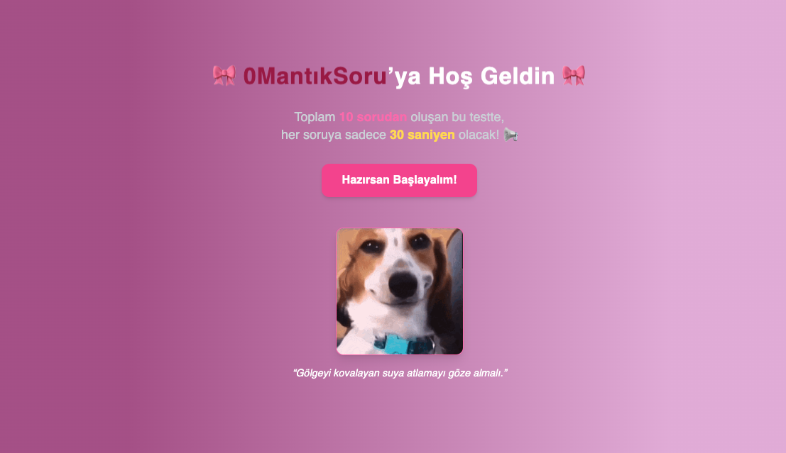

# QuestionApp

QuestionApp, kullanıcıların sorular sormasına ve cevaplar almasına olanak tanıyan bir uygulamadır. Bu README dosyası, projenin amacını, kurulum adımlarını, özelliklerini ve ekran görüntüleri için bir bölüm içermektedir.

---

## Proje Amacı

Bu proje, kullanıcıların bilgi paylaşımını kolaylaştırmak ve topluluk tabanlı bir soru-cevap platformu oluşturmak için geliştirilmiştir.

---

## Özellikler

- Kullanıcı kaydı ve giriş yapma
- Soru sorma ve cevaplama
- Sorulara oy verme
- Kullanıcı profili oluşturma
- Soru ve cevapları düzenleme

---

## Kurulum

1. **Depoyu Klonlayın**:
    ```bash
    git clone https://github.com/ilayddaa/QuestionApp
    cd QuestionApp
    ```

2. **Gerekli Bağımlılıkları Yükleyin**:
    ```bash
    npm install
    ```

3. **Geliştirme Sunucusunu Başlatın**:
    ```bash
    npm start
    ```


## Ekran Görüntüleri

### Ana Sayfa



### Netlify


---

## Lisans

Bu proje MIT Lisansı ile lisanslanmıştır. Daha fazla bilgi için `LICENSE` dosyasına bakabilirsiniz.

---

## İletişim

Herhangi bir sorunuz varsa, lütfen [ilydatass@gmail.com](mailto:ilydatass@gmail.com) adresinden iletişime geçin.
